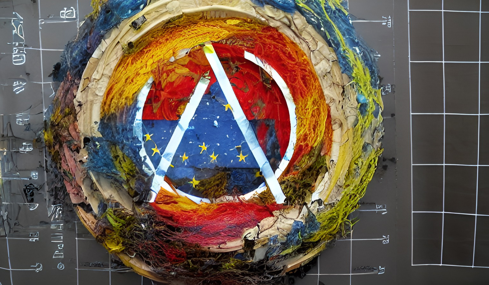

# Dissociated Press

<p align='center'></p>

This is quick realisation of the famous [Dissociated Press](https://en.wikipedia.org/wiki/Dissociated_press) algorythm - known from 70s, popular from 80s, and based on the simple Markov chain concept. In general, the algo can process any symbolic sequences (e.g. MIDI files), yet this code works only with plain texts.  

As the recent influx of the text-to-image toolkits has brought significant attention to the sole text processing, such small tools may face a new life as well. The image above depicts "atmospirational craftiand antipocalypse europlasticial art", written by DissPress, visualized by StableDiffusion. 

### Usage

There are two modes of 'remixing' the texts here:  
* Characted-based, preferrable for lengthy continuous texts. The algorithm starts by printing a number of consecutive letters from the source text. Then it searches the source text for the next occurrence of the few last letters printed out so far. It proceeds then with printing the text following the found occurrence. The process stops after the `--steps` amount of such jumps performed or if the end of file is reached, whatever happens first. (*edited from wiki*) 
```
 python disspress.py -i input.txt -o output.txt --steps 1000 
```
* Line-based, preferrable for the lists of short text strings. Similar approach with few changes: it starts from the beginning of the line, then seeks for the overlapping occurence on the following lines, continuing to grow the output string with the same procedure the `--steps` times (or till the `--maxlen` length is hit). If no occurences found at all, the beginning sample is dropped (as we don't want getting "unremixed" samples). The rest of the last found line is also added to the output string. Such process repeats for every input line, generating further strings. 
```
 python disspress.py -i input.txt -o output.txt --steps 10 --maxlen 128 --lines
```

The result is heavily affected by the parameters `--chunk` (the length of the continuous piece of input text) and `--overlap` (how many characters to overlap). Chunk 6 and overlap 2 will produce heavy wording mashup (can be real fun sometimes!), chunk 8 and overlap 3 will keep more correct wording but heavy syntax mashup, and so on. 

### Misc

For the archiving reasons there are also old versions of this algo on Perl (unsupported) and [vvvv beta](https://vvvv.org/). 
